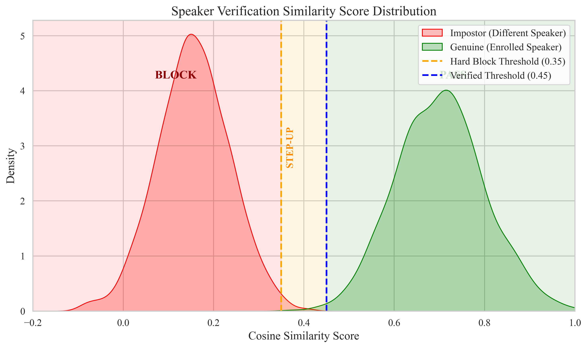
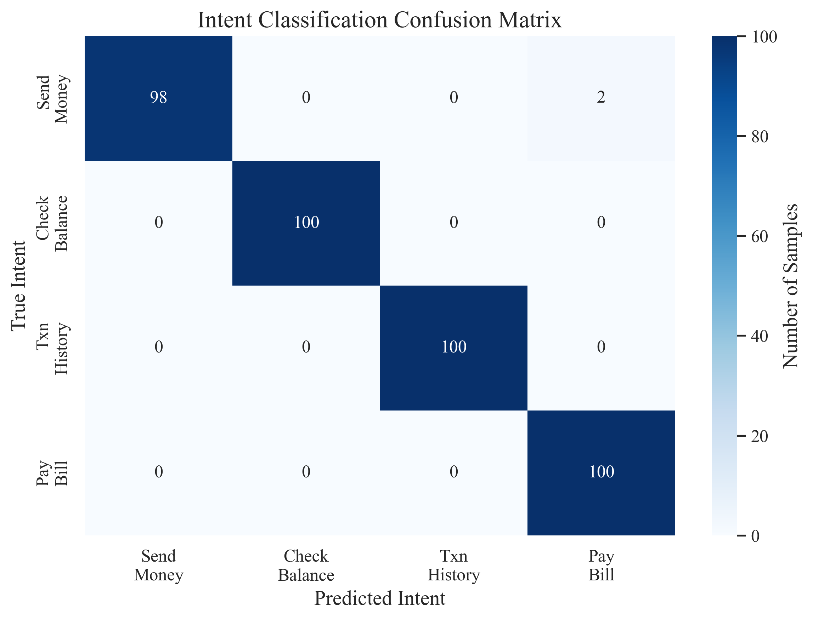
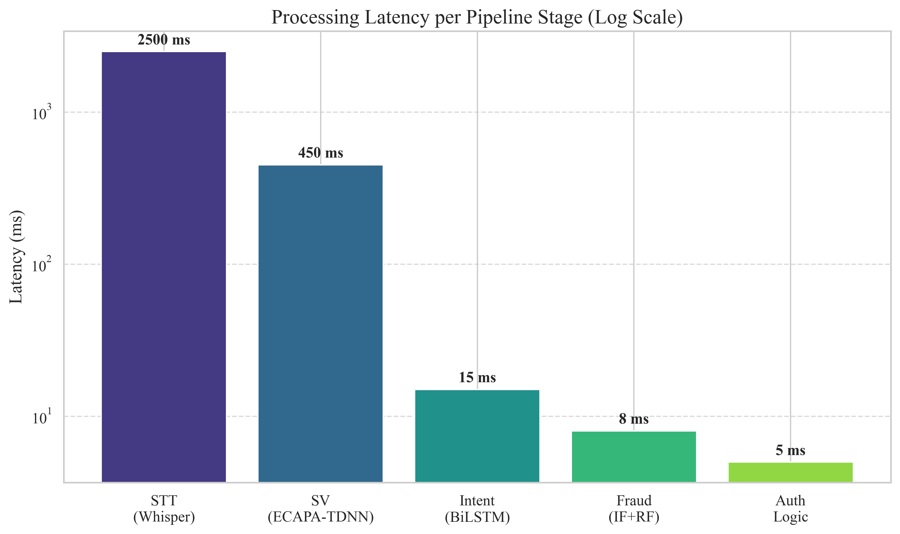

# 🎙️ Risk-Adaptive Voice Finance Assistant

<div align="center">
  
  <p>A full-stack financial application leveraging voice biometrics, NLP, and machine learning fraud detection to implement a dynamic, risk-adaptive authentication protocol.</p>
</div>


---

## 🌟 Overview

The **Risk-Adaptive Voice Finance Assistant** shifts away from static passwords to a dynamic trust model based on the **A.N.T. (Analysis, Neutralization, Transaction)** architecture. 

It processes spoken commands, verifies speaker identity using voice biometrics, classifies the intent, assesses behavioral fraud risk, and executes real payments via Razorpay—all gated by an incredibly polished, dynamic authentication policy.

### 🧠 Core Deep Learning Modules
- **Speech-To-Text (STT):** High-accuracy transcription using OpenAI's Whisper model (`medium` variant).
- **Intent Classification:** Custom PyTorch Bidirectional LSTM model achieving a **99.5% F1-score** for financial commands (e.g., "send money", "check balance").
- **Voice Biometrics:** Robust speaker verification using the `ECAPA-TDNN` architecture with cosine similarity and continuous High-Frequency Energy (HFE) liveness detection to prevent replay attacks.
- **Behavioral Fraud Detection:** An ensemble of Isolation Forest (unsupervised anomaly detection) and Random Forest (supervised classification) that continuously adapts to user spending habits via an online learning mechanism.

---

## 📸 System Showcase

| Intent Classifier Accuracy | Pipeline Latency Benchmarks |
| :---: | :---: |
|  |  |
| *Confusion matrix on 400 hold-out synthetic financial queries (99.5% Acc).* | *Log-scale latency distribution across the backend A.N.T. pipeline.* |

*Note: Replace UI mockups here with actual application screenshots if desired!*

---

## 🛡️ The Risk-Adaptive Auth Policy

Rather than a binary "accept/reject" system, the model generates a composite risk score to assign one of three Authentication Tiers:
| Risk Tier | Conditions Triggered | Auth Requirement |
| :--- | :--- | :--- |
| 🟢 **Low Risk** | High Voice Match + Low Fraud Score | **PIN Only** |
| 🟡 **Medium Risk** | Borderline Voice Match *OR* Slight Anomaly | **Step-Up (Voice + PIN)** |
| 🔴 **High Risk** | Replay Attack *OR* Voice Mismatch | **Hard Block** |

---

## 🛠️ Tech Stack

| Component | Technology |
|-----------|------------|
| Backend | FastAPI + Python 3.11 |
| Frontend | Vite + React + Vanilla CSS (Glassmorphism UI) |
| STT | OpenAI Whisper (`medium`) |
| Speaker Verification | SpeechBrain ECAPA-TDNN |
| Intent Classification | Bidirectional LSTM (PyTorch) |
| Fraud Detection | Isolation Forest + Random Forest (scikit-learn) |
| Payments Gateway | Razorpay (Orders API + Checkout.js) |
| Database | SQLite + SQLAlchemy |

---

## 🚀 Quick Start

### 1. Setup (One-Command)
```bash
git clone https://github.com/Dhanush-i/risk-adaptive-voice-finance-assistant.git
cd risk-adaptive-voice-finance-assistant
python scripts/setup.py
```
> **What this does:** Installs all Python and NPM dependencies, generates the synthetic ML datasets, trains the BiLSTM intent model and Fraud Ensemble models, and initializes the SQlite DB.

### 2. Configure Razorpay (Optional)
Edit the `.env` file with your test keys to enable real payment processing:
```env
RAZORPAY_KEY_ID=rzp_test_YOURKEY
RAZORPAY_KEY_SECRET=YOURSECRET
```
*(If you leave this out, the app will still work but will mock the payment execution phase).*

### 3. Run the Application
```bash
python scripts/run.py
```
This automatically spins up both the FastAPI backend and the Vite frontend. Navigate to **http://localhost:5173**.

---

## 📝 License
Distributed under the MIT License.
