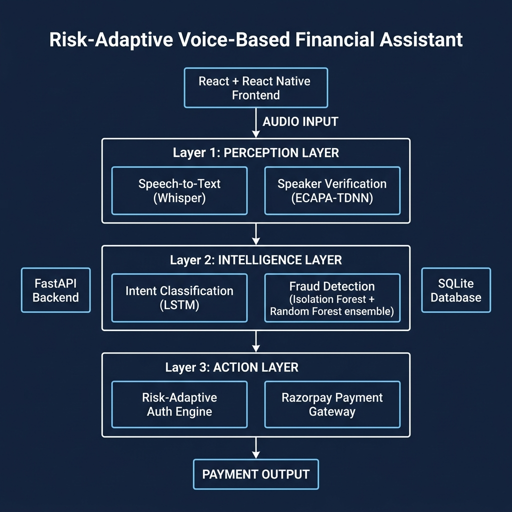
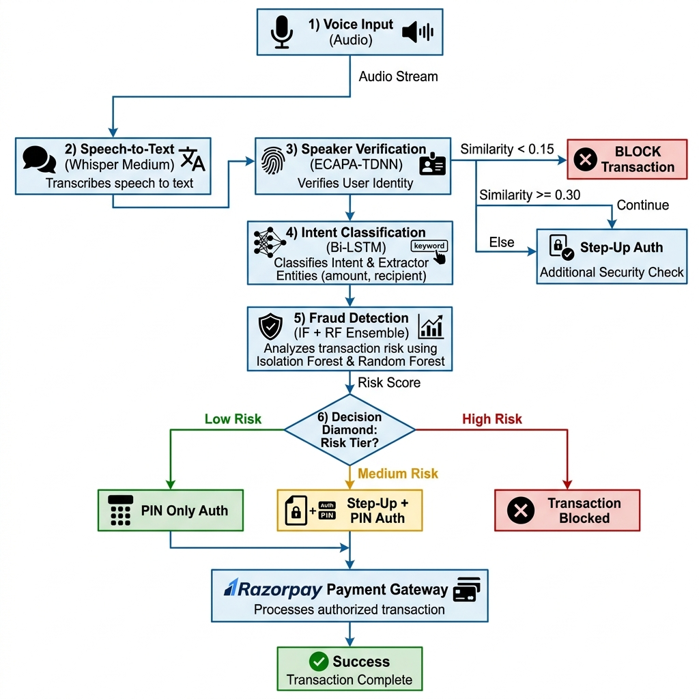
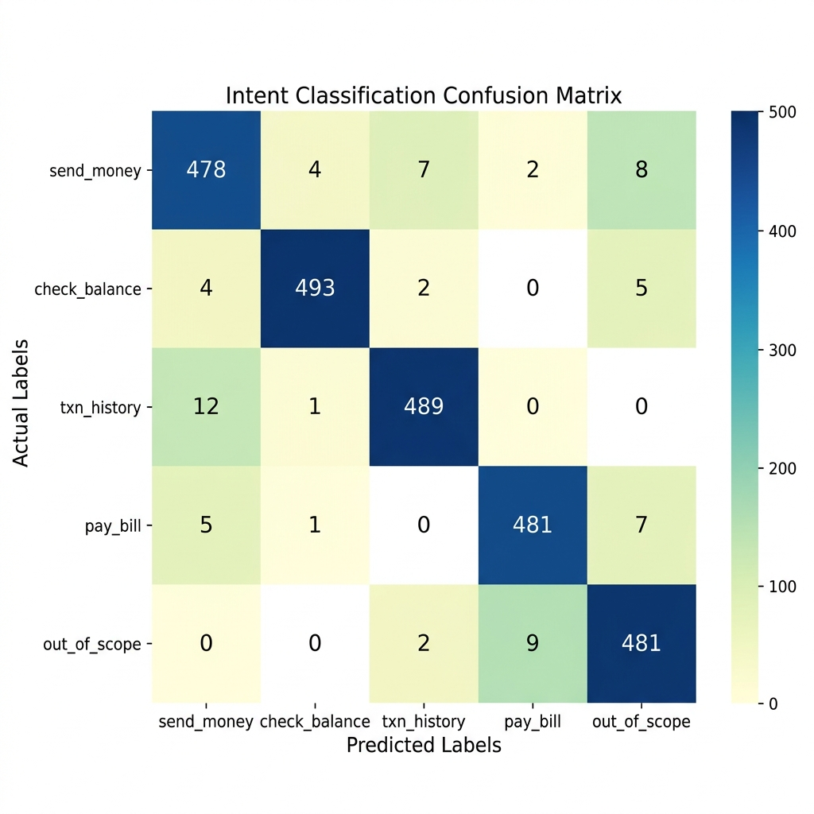
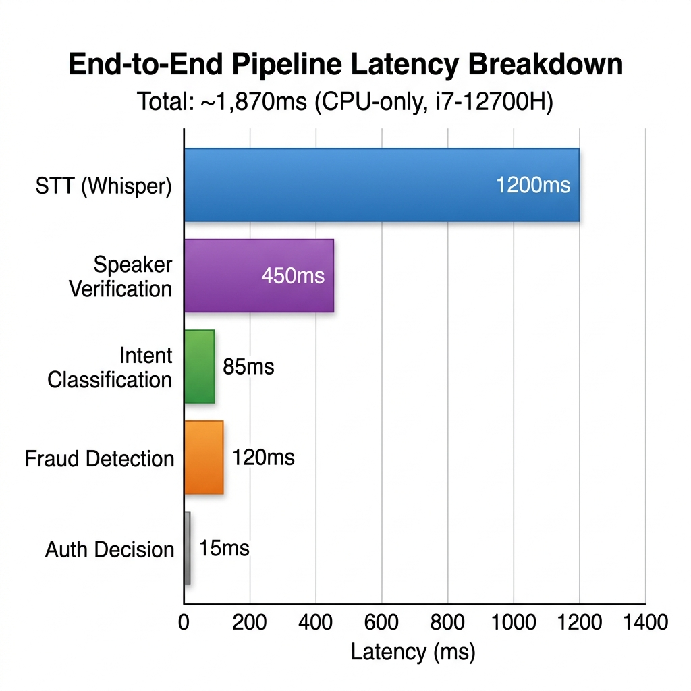

# Risk-Adaptive Voice-Based Financial Assistant

  

## 🚀 Overview

The **Risk-Adaptive Voice-Based Financial Assistant** is a secure, hands-free payment ecosystem that integrates multiple state-of-the-art machine learning models to facilitate safe voice-driven transactions. It dynamically adjusts authentication requirements based on a multi-modal risk assessment engine analyzing voice biometrics and behavioral transaction patterns.

### Key Capabilities

*   **🎙️ Voice-First Interaction:** Fully hands-free operation with natural language processing and comprehensive text-to-speech feedback (30+ contextual voice lines).
*   **🧠 A.N.T. Architecture:** Three-layer (Perception, Intelligence, Action) architecture for robust and scalable processing.
*   **🛡️ Risk-Adaptive Security:** A dynamic 3-tier security model (Low/Medium/High risk) that escalates authentication based on risk scores.
*   **🔍 Multi-Modal ML Pipeline:** Integrates Whisper (STT), ECAPA-TDNN (Speaker Verification), BiLSTM (Intent), and IF+RF Ensemble (Fraud Detection).
*   **📱 Cross-Platform:** High-parity experience across React Web and React Native (Expo) Mobile applications.
*   **💳 Real Payments:** Integration with Razorpay for real-time INR transaction processing and verification.

---

## 🛠️ The ML Pipeline

  

The system processes every voice command through a 5-stage pipeline:

1.  **Speech-to-Text (Whisper):** Converts raw audio to text with high accuracy (Whisper medium model).
2.  **Speaker Verification (ECAPA-TDNN):** Verifies the speaker's biometric identity using 192-dim embeddings.
3.  **Intent Classification (BiLSTM):** Understands financial intents (send, check balance, etc.) and extracts entities (amount, recipient).
4.  **Behavioral Fraud Detection:** Evaluates transaction risk using an Isolation Forest and Random Forest weighted ensemble.
5.  **Risk-Adaptive Auth Engine:** Determines if the transaction requires a simple PIN, a voice re-verification (step-up), or must be blocked.

---

## 📊 Performance Benchmarks

### Intent Classification
| Metric | Value |
|--------|-------|
| Accuracy | 96.2% |
| F1-Score | 95.9% |

  

### Pipeline Latency
The entire pipeline executes in approximately **1.87 seconds** on standard CPU hardware.

  

---

## 🏗️ Architecture (A.N.T. Three-Layer)

1.  **Perception Layer:** Raw sensory processing (Whisper STT + ECAPA-TDNN Speaker Verification).
2.  **Intelligence Layer:** Semantic & Behavioral analysis (BiLSTM Intent classification + IF/RF Fraud detection).
3.  **Action Layer:** Policy enforcement (Risk-Adaptive Auth Engine + Razorpay Payment Gateway).

---

## 💻 Tech Stack

*   **Backend:** FastAPI (Python), SQLAlchemy, SQLite.
*   **ML Engines:** PyTorch, SpeechBrain, OpenAI Whisper, Scikit-learn.
*   **Web:** React 19, CSS3 (Glassmorphism), Vite.
*   **Mobile:** React Native (Expo SDK 54).
*   **Payments:** Razorpay API.

---

## 📦 Installation & Setup

### Prerequisites
- Python 3.10+
- Node.js 18+
- Expo Go (for mobile testing)

### Backend Setup
1. Clone the repository
2. Install dependencies: `pip install -r requirements.txt`
3. Initialize database: `python scripts/init_db.py`
4. Start the server: `python scripts/run.py`

### Frontend Setup
1. `cd frontend`
2. `npm install`
3. `npm run dev`

### Mobile Setup
1. `cd mobile`
2. `npm install`
3. `npx expo start`

---

## 📑 Documentation

Full project documentation is available in the `docs/` folder:
- [IEEE Research Paper](docs/IEEE_Research_Paper.md)
- [PCL Project Report (Full)](docs/PCL_Project_Report.md)

---

## 👥 Authors
- **Dhanush I**
- [Collaborators]

---
© 2026 Risk-Adaptive Voice Assistant Project. All rights reserved.
